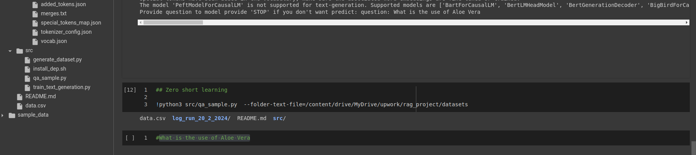
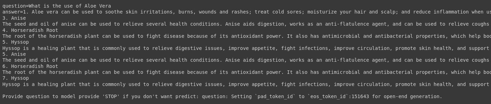

# rag_llm


## Simple question answering repo

## Real-Life Problem

You have list of knowldge datasets store in the txt file (i.e document)

You want build model answering question related to your document.

# Few-short learning

## First prepare env 

Conda

We recommend installing NeMo in a fresh Conda environment.

Step 1: 

```python
conda create --name llm_env python==3.10.12
conda activate llm_env
```


Step 2: Install PyTorch using their configurator.

```python
conda install pytorch torchvision torchaudio pytorch-cuda=11.8 -c pytorch -c nvidia
```

The command used to install PyTorch may depend on your system. Please use the configurator linked above to find the right command for your system.

Step 3: install other libs

```python
    bash src/install_dep.sh
```

## Generate RAG-DATASET 

Here I simple use small model to generate. In the real-life, you should prepare datasets RAG by hand or use stronger model like chatgpt,... to generate datasets.

folder-text-file: folder dirs contain many .txt files.

python3 src/generate_dataset.py --folder-text-file datasets/ --output-csv=datasets/data.csv


## Train text-generation model 


note that if dataset is large must be increase lora-r and lora-alpha

I just simple demo train-text-generation. 

python3 src/train_text_generation.py --csv-path datasets/data.csv \
        --output-folder ./log_run_20_2_2024 \
        --model-name="Qwen/Qwen1.5-4B" \
        --lora-r=8 --lora-alpha=16\
        --num-epochs=1\
        --save-steps=25\
        --learning-rate=0.00008


## Chatbot iteractive 

python3 src/qa_sample.py --model-path-or-name=./log_run_20_2_2024/model_lora \
                      --folder-text-file=datasets







## Notebook demo run full 3 steps

https://colab.research.google.com/drive/15asWuPSfaorRYg6QtOvAXbKihsFULgTV?usp=sharing


# Zero-short learning

For zero short learning, you should ignore step 1 and 2.

python3 src/qa_sample.py --folder-text-file=/datasets

